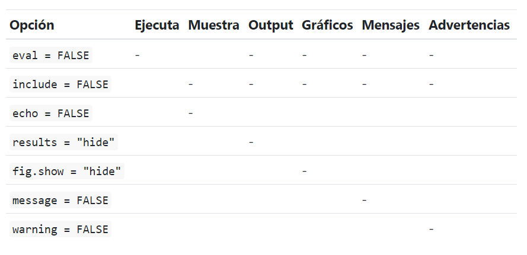

```{r setup, include=FALSE}
knitr::opts_chunk$set(echo = TRUE)
```


## R Markdown

R Markdown provee un marco de escritura para ciencia de datos, que combina tu código, sus resultados y tus comentarios en prosa. Los documentos de R Markdown son completamente reproducibles y soportan docenas de formatos de salida tales como PDFs, archivos de Word, presentaciones y más (Hadley Wickam). 

## Como abrir un archivo 

File > New File > R Markdown > Title > Author > Tipo de documento (html, pdf) > Save

## Partes de Markdown

1. Encabezado YAML(yet another markup language)

2. Bloques de codigo o chunks: los abrimos seleccionando insert o Crt+Alt+I
   - Nombre
   - eval = FALSE evita que el código sea evaluado
   - include = FALSE ejecuta el código, pero no muestra el código 
   - echo = FALSE evita que se vea el código, pero sí muestra los resultados en el archivo final
   - message = FALSE o warning = FALSE evita que aparezcan mensajes o advertencias en el archivo final
   - results = 'hide' oculta el output impreso
   - fig.show = 'hide' oculta gráficos
   - error = TRUE causa que el render continúe ejecutando incluso si el código devuelve un error
   


   
```{r base1, include=FALSE, warning=FALSE, message=FALSE}
library(tidyverse)
library(dplyr)
library(readxl)
library(summarytools)

eph.1.20 <- read.table("usu_individual_T120.txt", header = TRUE, sep = ";")
```

```{r base2}
#Creamos los ocupados 

Poblacion_ocupados <- eph.1.20 %>% 
  summarise(Poblacion         = sum(PONDERA),
            Ocupados          = sum(PONDERA[ESTADO == 1]))
Poblacion_ocupados
```

```{r grafico1, echo=FALSE, fig.align='center'}
plot(iris$Sepal.Length, iris$Petal.Length)
```

3. Bloques de texto

Titulo en negrita: 

## **Datos** 

Titulo normal:

## Datos 

Titulo con items: 

### Datos 

* _Ejemplo_
* _Ejemplo_


